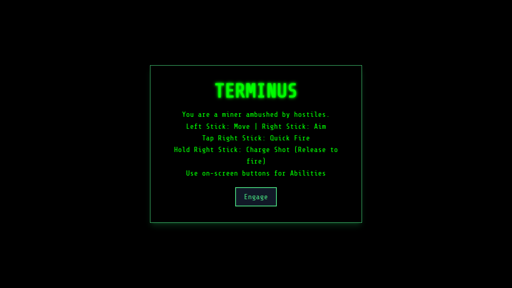
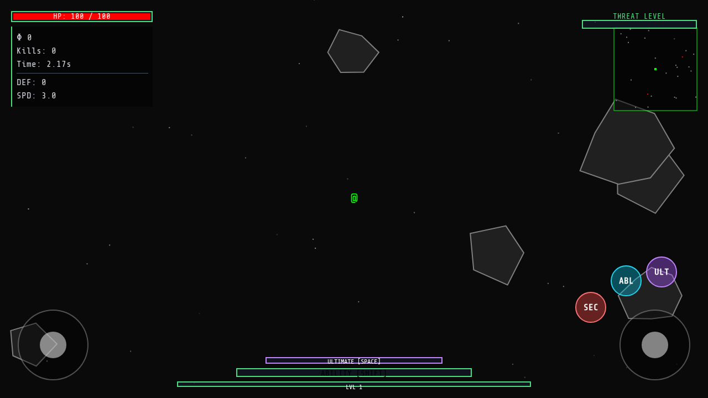

# Terminus - Asteroid Miner


> **Terminus** is an intense, twin-stick style survival game built with React, TypeScript, and HTML5 Canvas. You play as a miner ambushed by hostile forces, forced to fight for survival using an array of weapons, abilities, and upgrades.

## 📸 Screenshots

*

| Main Menu | Gameplay | Upgrades |
| :---: | :---: | :---: |
|  |  |  |


## 🚀 Features

- **Dynamic Combat System:**
  - **Quick Fire:** Rapidly dispatch enemies with your primary weapon.
  - **Charged Shots:** Hold to charge and unleash devastating attacks.
- **Abilities & Ultimates:** Utilize unique skills and ultimate attacks (e.g., Nova Blast, Singularity) to control the battlefield.
- **Progression & Upgrades:** Collect XP Orbs to level up and gain access to randomized upgrades (increased damage, speed, max health, etc.).
- **Resource Management:** Collect resources from destroyed asteroids to manage your shields and health.
- **Diverse Entities:** Face off against varied enemies, from standard Grunts and fragile swarmers to heavy juggernauts and bosses.
- **Custom Game Engine:** A highly modular entity-component style system built entirely using React Hooks (`useGameEngine`) and HTML5 Canvas.

## 🛠️ Tech Stack

- **Framework:** React 19
- **Build Tool:** Vite
- **Language:** TypeScript
- **Rendering:** HTML5 Canvas API

## 📁 Project Structure

The project is structured to separate UI from the game logic:

- `components/Game.tsx`: The main React component rendering the Canvas and HUD.
- `hooks/useGameEngine.ts`: The core game loop, handling state updates, input processing, collision detection, and rendering.
- `systems/entities.ts`: Classes and logic for all game objects (Player, Enemies, Projectiles, Particles, etc.).
- `systems/database.ts`: Definitions for weapons, abilities, and ultimates.
- `types.ts`: TypeScript interfaces and enums for strict typing across the game.
- `constants.ts`: Core game configuration variables.

## 🕹️ Controls

- **Movement:** Left Stick (or keyboard mapped equivalents)
- **Aiming:** Right Stick (or Mouse)
- **Fire:** Tap Right Stick (or Left Click)
- **Charged Shot:** Hold Right Stick (or Hold Left Click) and release
- **Abilities/Ultimates:** On-screen HUD buttons

## 📦 Getting Started

### Prerequisites
Make sure you have Node.js installed.

### Installation

1. Clone the repository and navigate to the project directory.
2. Install dependencies:
   ```bash
   npm install
   ```
3. If necessary, create a `.env.local` file and add any required API keys (e.g., `GEMINI_API_KEY` if utilizing the AI Studio integration).

### Running the Game

Start the development server:
```bash
npm run dev &
```

### Building for Production

Create an optimized build:
```bash
npm run build
```

Preview the production build:
```bash
npm run preview
```
